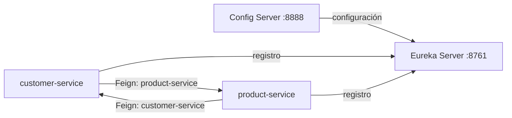

# Eureka Server

Servidor de descubrimiento de servicios del ecosistema FinTech.

Registra Customer Service y Product Service para que puedan comunicarse mediante sus nombres lógicos, sin configurar URLs directas entre ellos.

## Integración



Es un servicio de infraestructura sin lógica de negocio, por lo que no utiliza arquitectura hexagonal.

## Configuración principal

La configuración se obtiene desde [fintech-config](https://github.com/FedeBacelar/fintech-config):

| Propiedad | Valor |
|---|---|
| Puerto | `8761` |
| Hostname | `localhost` |
| Registro del propio servidor | Deshabilitado |
| Consulta de otro registro Eureka | Deshabilitada |

Eureka funciona en modo standalone: no se registra a sí mismo ni depende de otro servidor Eureka.

## Requisitos

- Java 21.
- [Config Server](https://github.com/FedeBacelar/config-server) en `localhost:8888`.

No requiere MySQL.

## Ejecución

```text
# Windows
.\mvnw.cmd spring-boot:run

# Linux o macOS
./mvnw spring-boot:run
```

Debe iniciarse después de Config Server y antes de los servicios de negocio.

## Verificación

- Dashboard: [http://localhost:8761](http://localhost:8761)
- Health check: [http://localhost:8761/actuator/health](http://localhost:8761/actuator/health)
- Registro de aplicaciones: [http://localhost:8761/eureka/apps](http://localhost:8761/eureka/apps)

El registro se devuelve en XML por defecto. Para solicitar JSON:

```bash
curl -H "Accept: application/json" http://localhost:8761/eureka/apps
```

Con ambos servicios de negocio ejecutándose, el dashboard debe mostrar `CUSTOMER-SERVICE` y `PRODUCT-SERVICE`.

Config Server también debe estar disponible para ejecutar las verificaciones:

```text
# Windows
.\mvnw.cmd clean verify

# Linux o macOS
./mvnw clean verify
```

## Repositorios relacionados

- [config-server](https://github.com/FedeBacelar/config-server)
- [fintech-config](https://github.com/FedeBacelar/fintech-config)
- [customer-service](https://github.com/FedeBacelar/customer-service)
- [product-service](https://github.com/FedeBacelar/product-service)
